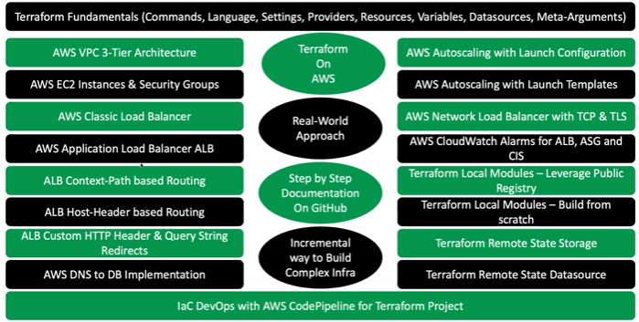
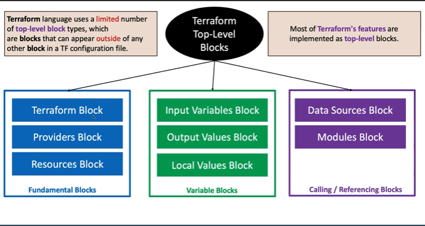
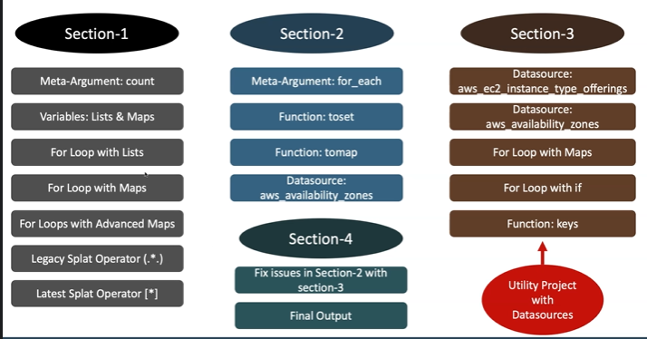
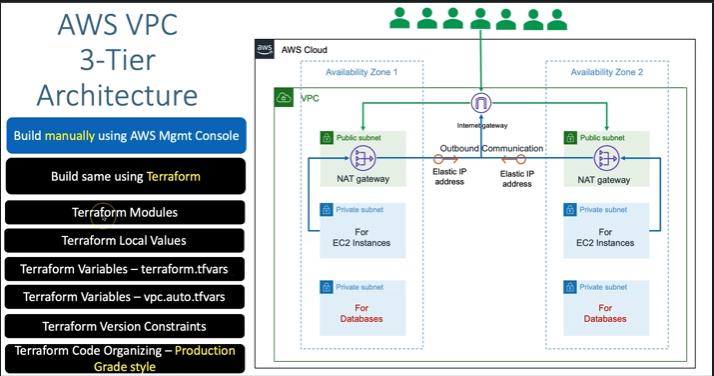

## Terraform Fundimentals

## content
- Terraform Basics
- Terraform Settings, 
- Terraform Providers,
- terraform resources

- terraform inputs,
- terraform varibles,
- terraform Datasources, 
- terraform output values,

- terraform loops,
- terraform MetaAurguments,
- terraform Splat Operator and Functions.

## AWS VPC 3-Tire Architecture

## AWS VPC + EC2 instance + Security Group
