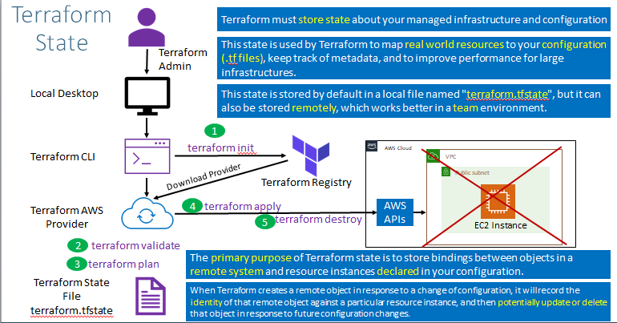
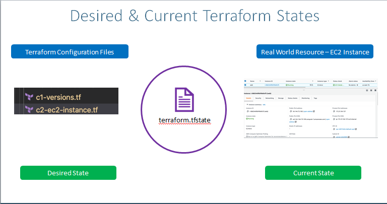

## Terraform State Basics

- Terraform must store State About your managed infrastructure and configuration
- This state is used by terraform to map real world resources to your configuration(.tf files) keep track of metadata, and to improve performance for large infrastructures
- This state is stored by Default in a local file named "terraform.tfstate" but it can also be stored in remotely,which works better in a team envinorment.
- The primary purpose of Terraform  state is to store binding between objects in a remote system and resource instance decleared in your configuration 

## Desired & Current Terraform States
