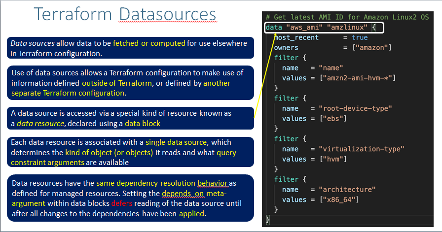
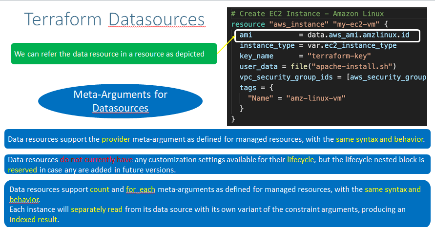

## Terraform Datasource
- Data sources allow data to be fetched or computed for use elsewhere in Terraform configuration.
- Use of data sources allows a Terraform configuration to make use of information defined outside of Terraform, or defined by another separate Terraform configuration.

