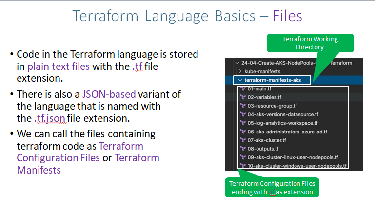
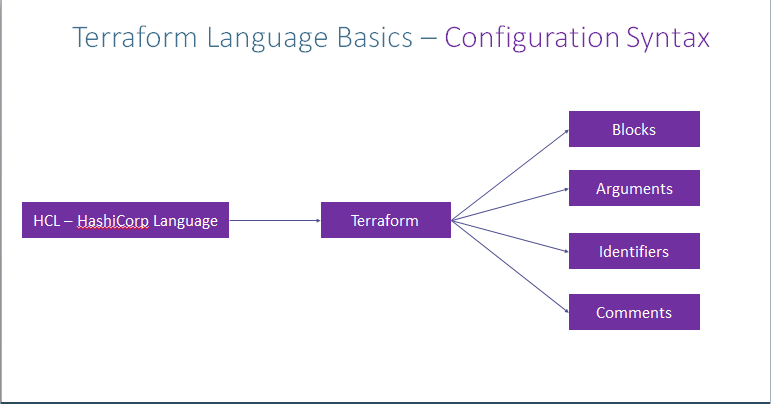
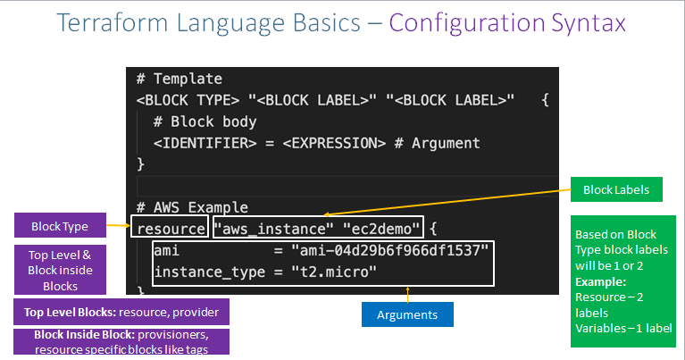
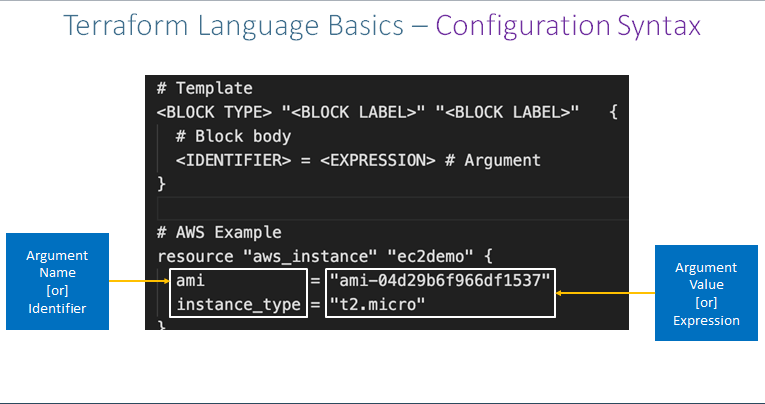
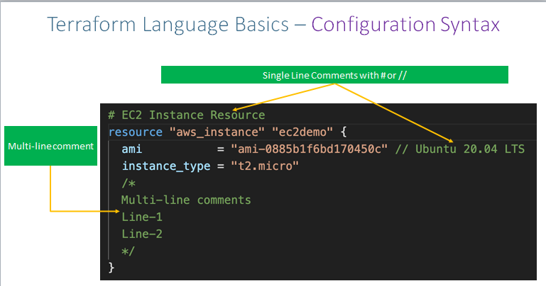

## Terraform configuration Language Syntax

# Step-01: Introduction
- understand Terraform Language Basics
    - Understad Blocks
    - Understand Arguments,Attributes Meta-Aurgements
    - Understand Identifiers
    - Understand Comments
## Step-02: Terraform configuration Language Syntax
- Understand Blocks
- Understand Aurguments
- Understand Identifiers
- Understand Comments
- [Terraform Configuration](https://www.terraform.io/docs/configuration/index.html)
- [Terraform Configuration Syntax](https://www.terraform.io/docs/configuration/syntax.html)

```t
# Template
<BLOCK TYPE> "<BLOCK LABEL>" "<BLOCK LABEL>"   {
  # Block body
  <IDENTIFIER> = <EXPRESSION> # Argument
}

# AWS Example
resource "aws_instance" "ec2demo" { # BLOCK
  ami           = "ami-04d29b6f966df1537" # Argument
  instance_type = var.instance_type # Argument with value as expression (Variable value replaced from varibales.tf
}
```

## Terraform Language Basics - File 

## Terraform Language Basics Configuration Syntax

## Terraform Language Basics - Configuration Syntax `Understand Blocks`

## Terraform Language Basics - Configuration Syntax `Understand Blocks`


## 
