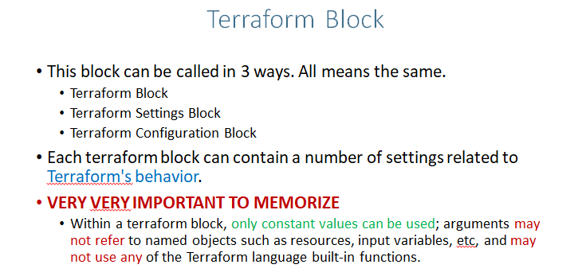
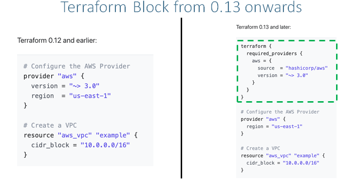
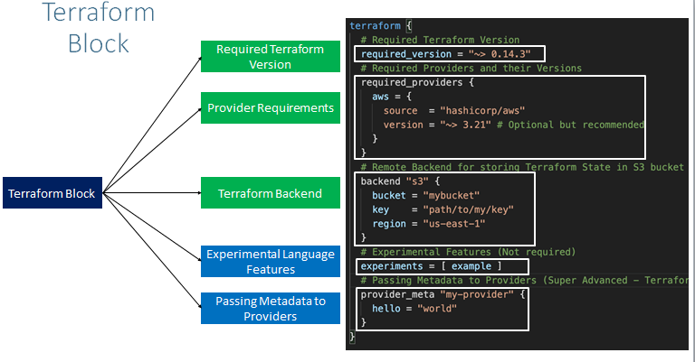

## terraform Block
- This can be called in 3 ways All means the same,
    - terraform block 
    - terraform settings block 
    - terraform configuration block
- Each terraform block can contain a number of settings related to `Terraform's behavior`
- VERY VERY IMPORTANT TO MEMORIZE
    - Within a terraform block, only constant values can be used
    - Aurgments may not refer to named objects such as resources, input varibles, etc and may not use any of the terraform language built-in functions

**NOTE**

