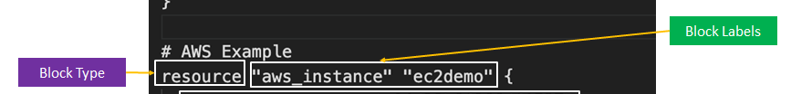
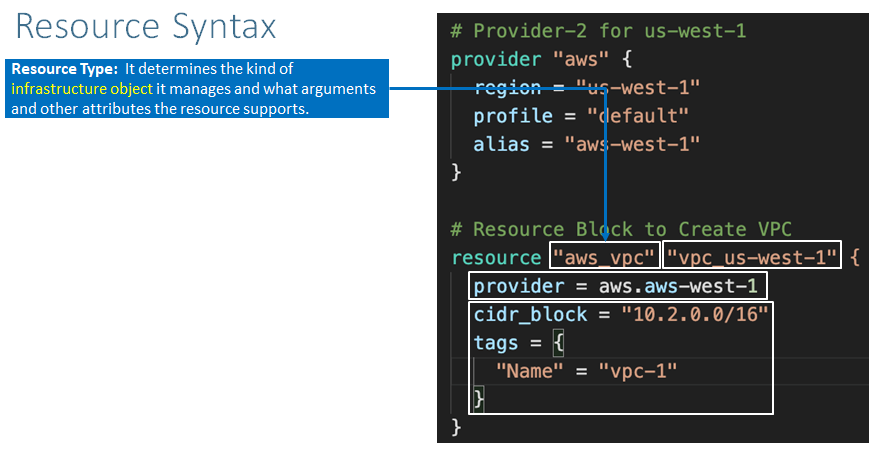
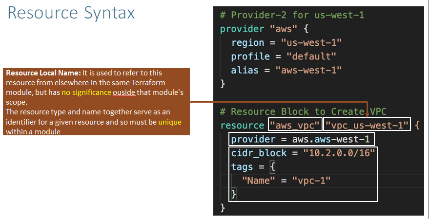
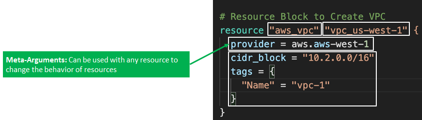
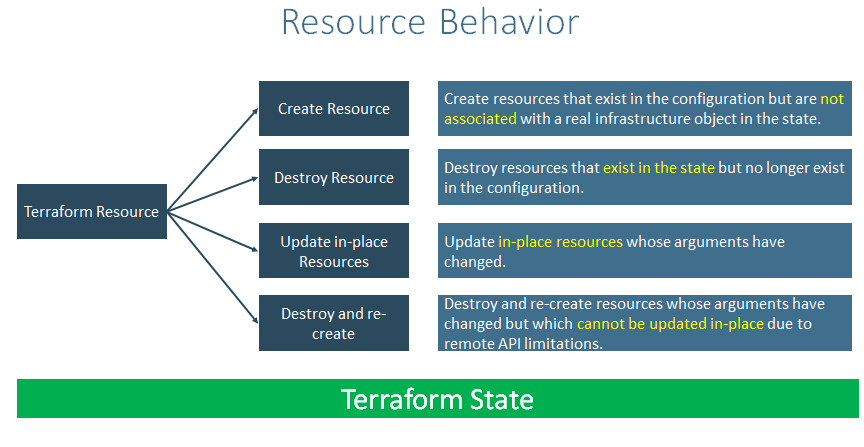

## Teerraform Language Basics - Configuration Syntax
- **Block Type-** Block type we have is different types blocks ex: resource,varibles,output,provider,terraform,modules,data,locals
- **Block Labels** Resource Lables Hear
- **Top level block-**  Top level blocks are for ex: resource,varibles,output,provider,terraform,modules,data,locals
- **Block inside Block-** Block Level Blocks Are Resource specfic Blocks Ex: provisioners,tags 
- **Number of Lables-** for Resources have two block or three lables, and for varibles we have one block lable, based on the block type you will find sone thing number of lables That Respective Block,what ever you define inside that blocks are called the aurgements with aurgement value
## BlockType


## Resource Syntax
- **Resource** 
- **Resource type :** It determines the kind of infrastructure Object it manages What arguments and other attributes the resource supports.

- **Resource Lable or Resource Local name** it is key iteam for entair terraform This resource Local Name is used to reffer this resource from elsewherw in the terraform modules but
- But Has no significance outside That module's scope
- Resource type and name together serves as an identifer for a given resource and so must be unique with in the module 

- **Meta-Aurgements :** Meta aurgements can be used with any Resource  to chainge the behavior of resource 


- **Resource Aurgements:** Resource Aurgements will be specific to resource type 
- the aurgement values can make use of Expressions or other terraform Dynamic Language Featurs

## Teraform Resource Behaviour


**Terraform Resource**
- **Create Resource:**  Creat Resource that exist in the Configuration but are not associated with a real time infrastructure object in the state.

- **Destroy Resource:** Destroy resource That exist in the state but no longer exist in the configuration 
- **Update in-place Resources:** Update in-place resource whose aurgements have chainged 
- **Destroy and re-create:** Destroy and recreate resources whose aurgements


## Step-04: In c2-ec2instance.tf -  Create Resource Block
- Understand about [Resources](https://www.terraform.io/docs/language/resources/index.html)
- Create [EC2 Instance Resource](https://registry.terraform.io/providers/hashicorp/aws/latest/docs/resources/instance)
- Understand about [File Function](https://www.terraform.io/docs/language/functions/file.html)
- Understand about [Resources - Argument Reference](https://registry.terraform.io/providers/hashicorp/aws/latest/docs/resources/instance#argument-reference)
- Understand about [Resources - Attribute Reference](https://registry.terraform.io/providers/hashicorp/aws/latest/docs/resources/instance#attributes-reference)
```t
# Resource: EC2 Instance
resource "aws_instance" "myec2vm" {
  ami = "ami-0533f2ba8a1995cf9"
  instance_type = "t3.micro"
  user_data = file("${path.module}/app1-install.sh")
  tags = {
    "Name" = "EC2 Demo"
  }
}
```


# Terraform Settings, Providers & Resource Blocks
## Step-01: Introduction
- [Terraform Settings](https://www.terraform.io/docs/language/settings/index.html)
- [Terraform Providers](https://www.terraform.io/docs/providers/index.html)
- [Terraform Resources](https://www.terraform.io/docs/language/resources/index.html)
- [Terraform File Function](https://www.terraform.io/docs/language/functions/file.html)
- Create EC2 Instance using Terraform and provision a webserver with userdata. 

## Step-02: In c1-versions.tf - Create Terraform Settings Block
- Understand about [Terraform Settings Block](https://www.terraform.io/docs/language/settings/index.html) and create it
```t
terraform {
  required_version = "~> 0.14" # which means any version equal & above 0.14 like 0.15, 0.16 etc and < 1.xx
  required_providers {
    aws = {
      source  = "hashicorp/aws"
      version = "~> 3.0"
    }
  }
}
```

## Step-03: In c1-versions.tf - Create Terraform Providers Block 
- Understand about [Terraform Providers](https://www.terraform.io/docs/providers/index.html)
- Configure AWS Credentials in the AWS CLI if not configured
```t
# Verify AWS Credentials
cat $HOME/.aws/credentials
```
- Create [AWS Providers Block](https://registry.terraform.io/providers/hashicorp/aws/latest/docs#authentication)
```t
# Provider Block
provider "aws" {
  region  = us-east-1
  profile = "default"
}
```

#############

#############


## Step-05: Review file app1-install.sh
```sh
#! /bin/bash
# Instance Identity Metadata Reference - https://docs.aws.amazon.com/AWSEC2/latest/UserGuide/instance-identity-documents.html
sudo yum update -y
sudo yum install -y httpd
sudo systemctl enable httpd
sudo service httpd start  
sudo echo '<h1>Welcome to StackSimplify - APP-1</h1>' | sudo tee /var/www/html/index.html
sudo mkdir /var/www/html/app1
sudo echo '<!DOCTYPE html> <html> <body style="background-color:rgb(250, 210, 210);"> <h1>Welcome to Stack Simplify - APP-1</h1> <p>Terraform Demo</p> <p>Application Version: V1</p> </body></html>' | sudo tee /var/www/html/app1/index.html
sudo curl http://169.254.169.254/latest/dynamic/instance-identity/document -o /var/www/html/app1/metadata.html
```

## Step-06: Execute Terraform Commands
```t
# Terraform Initialize
terraform init
Observation:
1) Initialized Local Backend
2) Downloaded the provider plugins (initialized plugins)
3) Review the folder structure ".terraform folder"

# Terraform Validate
terraform validate
Observation:
1) If any changes to files, those will come as printed in stdout (those file names will be printed in CLI)

# Terraform Plan
terraform plan
Observation:
1) No changes - Just prints the execution plan

# Terraform Apply
terraform apply 
[or]
terraform apply -auto-approve
Observations:
1) Create resources on cloud
2) Created terraform.tfstate file when you run the terraform apply command
```

## Step-07: Access Application
- **Important Note:** verify if default VPC security group has a rule to allow port 80
```t
# Access index.html
http://<PUBLIC-IP>/index.html
http://<PUBLIC-IP>/app1/index.html

# Access metadata.html
http://<PUBLIC-IP>/app1/metadata.html
```

## Step-08: Terraform State - Basics
- Understand about Terraform State
- Terraform State file `terraform.tfstate`
- Understand about `Desired State` and `Current State`


## Step-09: Clean-Up
```t
# Terraform Destroy
terraform plan -destroy  # You can view destroy plan using this command
terraform destroy

# Clean-Up Files
rm -rf .terraform*
rm -rf terraform.tfstate*
```


## Step-10: Additional Observations - Concepts we will learn in next section
- EC2 Instance created we didn't associate a EC2 Key pair to login to EC2 Instance 
  - Terraform Resource Argument - `Key Name`
- AMI Name is static - How to make it Dynamic ?
  - Use `Terraform Datasources` concept
- We didn't create multiple instances of same EC2 Instance
  - Resource Meta-Argument: `count` 
- We didn't add any variables for parameterizations
  - Terraform `Input Variable` Basics
- We didn't extract any information on terminal about instance information 
  -  Terraform `Outputs`
- Create second resource only after first resource is created
  - Defining Explicit Dependency in Terraform using Resource Meta-Argument `depends_on`
- WE ARE GOING TO LEARN ALL THE ABOVE CONCEPTS IN NEXT SECTION
  