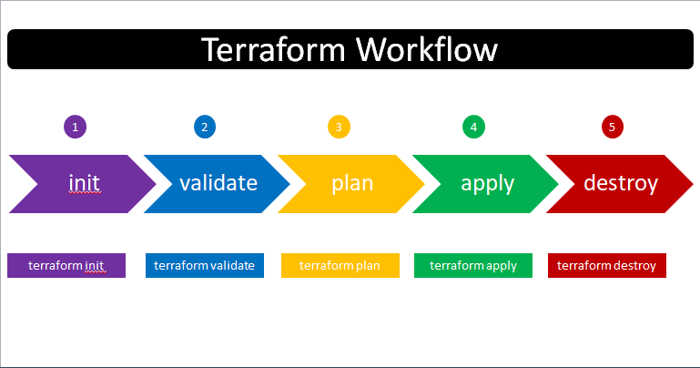

# Terraform Command Basics

## Step-01: Introduction
- Understand basic Terraform Commands
  - terraform init
  - terraform validate
  - terraform plan
  - terraform apply
  - terraform destroy      

## Step-02: Review terraform manifest for EC2 Instance
- **Pre-Conditions-1:** Ensure you have **default-vpc** in that respective region
- **Pre-Conditions-2:** Ensure AMI you are provisioning exists in that region if not update AMI ID 
- **Pre-Conditions-3:** Verify your AWS Credentials in **$HOME/.aws/credentials**